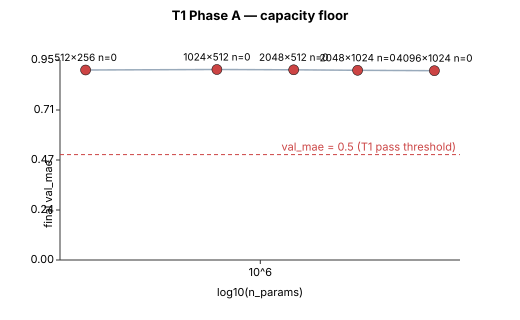

# T1 — capacity floor (HALT-AND-DEBUG)

*Datestamp:* 2026-05-04. *Branch:* `m5-davi`. *Hardware:* M4 Max, MPS, torch 2.11.

## Outcome

**T1 closes in halt-and-debug mode.** No Phase A cell met the val_mae < 0.5
acceptance threshold; three follow-up diagnostic variants confirmed the
failure is **not capacity** — it's an interaction between MSE loss, the
peaked V\* depth distribution, and the BatchNorm-MLP architecture that
traps optimization near "predict the mean." Phase B (residual sweep) was
**not opened**, per methodology §T1: *"if nothing succeeds at the anchor,
the failure isn't capacity, it's optimization/BN/eval/data — and we stop
and debug instead of going to Phase B."*

The diagnosis, hypotheses, and concrete next-cycle experiments are in
[`intuition.md`](intuition.md) (also appended at the bottom of this file).

## Pre-flight (per cold handoff)

T0 calibration data (`runs/20260503T033459Z_calibration/calibration.jsonl`)
projected `(8192, 2048)` n=0 batch 1024 to ~50–70 ms/step — over the
~30 ms/step ceiling that keeps the 6-cell Phase A under a 30-min budget.
**Top cell dropped; ladder re-anchored at `(4096, 1024)` per the cold
handoff's prescribed escape clause.** Resulting Phase A was 5 cells, not 6.

## Phase A — width sweep (n_residual_blocks = 0)

All cells: batch 1024, 7000 steps, lr=1e-3, seed 0, split_seed 42 (V\* split:
2,939,328 train / 734,832 val; eval on 10,000-state val subset).

| cell | h1 × h2 | n_res | n_params | final val_mae | passes (<0.5) |
|------|---------|-------|----------|--------------:|:-------------:|
| phaseA_5_512x256 | 512 × 256 | 0 | 207K | 0.9017 | ✗ |
| phaseA_4_1024x512 | 1024 × 512 | 0 | 677K | 0.9037 | ✗ |
| phaseA_3_2048x512 | 2048 × 512 | 0 | 1.35M | 0.9023 | ✗ |
| phaseA_2_2048x1024 | 2048 × 1024 | 0 | 2.40M | 0.8998 | ✗ |
| phaseA_1_4096x1024 | 4096 × 1024 | 0 | 4.80M | 0.8979 | ✗ |

**Predict-the-mean baseline on V\*: 0.9286.** All 5 cells finish within
0.03 of this no-information baseline. Across a **23× param scale-up**
(207K → 4.80M), final val_mae varies by 0.006 — n_params explains
essentially none of the variance.

Loss curves show the same pattern across all cells: train MSE drops
from ~1.43 at step 1k to ~1.22 at step 7k, then flattens. Val MAE
correlates with train loss but plateaus a hair above the
predict-the-mean baseline.

See [`plots/phaseA_pareto.html`](plots/phaseA_pareto.html) for the
(n_params, val_mae) frontier. The frontier is essentially horizontal —
not a curve at all.

## Diagnostic experiments

After Phase A's flat-failure, three diagnostic variants probed whether
the failure is fixable by scaling along axes Phase A held fixed
(steps, LR, residual depth). Results stored under
`runs/diag_<config>/`.

| variant | body | n_res | steps | LR | final val_mae | delta vs Phase A baseline |
|---------|------|------:|------:|---:|--------------:|--------------------------:|
| diag_4096x1024_n0_30k_lr3e-3 | 4096 × 1024 | 0 | 30,000 | 3e-3 | **0.8456** | −0.05 vs phaseA_1 |
| diag_1024x512_n2_7k_lr1e-3 | 1024 × 512 | 2 | 7,000 | 1e-3 | **0.8652** | −0.04 vs phaseA_4 |
| diag_2048x512_n4_30k_lr3e-3 | 2048 × 512 | 4 | 30,000 | 3e-3 | **0.7968** | −0.11 vs phaseA_3 |

**Reading.** Each axis we relax (more steps, more residuals, higher LR)
helps a little. Combining all three (diag #3) helps the most. But the
curve from 0.93 (predict-mean) to 0.5 (T1 acceptance) is barely dented:
the most aggressive variant still sits 0.30 absolute above the target.

## Diagnosis: regression-to-mean compression

A prediction-distribution probe on diag #3 (the most aggressively
trained model) on 5000 random V\*-labeled states:

- **Predictions:** range 5.24–12.31, mean 10.67, **std 0.79**
- **Targets:** range 0–14, mean 10.67, **std 1.16**

Per-depth means:

| true depth | predicted mean | predicted std | per-depth MAE |
|-----------:|---------------:|--------------:|--------------:|
| 6  | 6.99  | 0.70 | 0.99 |
| 7  | 8.07  | 0.91 | 1.13 |
| 8  | 9.11  | 0.93 | 1.21 |
| 9  | 9.92  | 0.83 | 1.06 |
| 10 | 10.53 | 0.64 | 0.72 |
| 11 | 10.90 | 0.48 | 0.36 |
| 12 | 11.10 | 0.40 | 0.90 |
| 13 | 11.26 | 0.42 | 1.74 |

**The model orders depths correctly** — predictions monotonically
increase with true depth. But predictions are **systematically pulled
toward the mean**: depth-11 (the modal class, 36.77% of states) is fit
nearly perfectly; tails (depths 6, 13) have the model predicting values
1.5+ off the truth.

Train-mode and eval-mode predictions differ by < 0.02 → BatchNorm
running statistics aren't drifted. The compression is in the body's
representation magnitude, not in BN running-stat drift.

## V\* depth distribution context

Why this distribution shape matters:

| depth | count | % | cumulative |
|------:|------:|--:|-----------:|
| 0–4 | 688 | 0.02% | 0.02% |
| 5–8 | 158,432 | 4.31% | 4.33% |
| 9 | 360,508 | 9.81% | 14.14% |
| **10** | **930,588** | **25.33%** | 39.47% |
| **11** | **1,350,852** | **36.77%** | 76.24% |
| **12** | **782,536** | **21.30%** | 97.54% |
| 13 | 90,280 | 2.46% | 100.00% |
| 14 | 276 | 0.01% | — |

83% of the 3.67M canonical states sit at depths 10–12. MSE loss with
this distribution shape strongly rewards mean-prediction — the bulk
loss contribution is huge, the tail loss contribution is tiny. The
gradient pressure away from "predict the mean" is dominated by the
gradient pressure toward "predict the mean" until the model has built
up enough representational capacity to fit *both* the bulk and the
tails simultaneously. Under MSE + BN-everywhere + Adam at 1e-3, that
build-up is far too slow to fit within T1's budget.

## What this tells us about the methodology

1. **The "earn every hyperparameter" framing remains correct, but the
   *order of questions* may need adjustment.** T1 was framed as a
   capacity question with placeholder LR and placeholder loss. The
   actual first question for this problem may be: *"what loss /
   normalization choice produces gradient signal that escapes
   mean-collapse?"* Capacity comes after that.
2. **Bracketing capacity from above (per the corrected methodology)
   was the right call** but didn't surface the bug because the bug is
   not capacity-shaped — it's loss-distribution-shaped. The bug is
   invisible to a width sweep no matter which direction you walk.
3. **The diagnostic axis-relaxation pattern (more steps / more
   residuals / higher LR) is good cycle hygiene** — it rules out
   "trivially under-budgeted" before declaring a fundamental issue.
4. **The methodology's halt-and-debug provision worked exactly as
   designed.** Phase A flagged the issue clearly; Phase B was not
   opened on a compromised baseline.

## Next-cycle work

See [`intuition.md`](intuition.md) **Open questions** for the four
specific debug experiments (L1 loss, BN-before-head ablation, LR
warmup, memorize-1k sanity) plus the methodology-level question of
whether T1 should be reframed as a two-question tier.

The next cycle does **not** open T2 — T1 must close cleanly with a
`(h1*, h2*, n*)` tuple before LR-range testing can mean anything.

## Pareto plot

 — open
[`plots/phaseA_pareto.html`](plots/phaseA_pareto.html) for the live view.

---

*The intuition.md content below is the hand-written observation /
hypothesis / open-questions document, per project convention.*

# t1-capacity intuition

*Datestamp:* 2026-05-04. *Run conditions:* Phase A on `m5-davi` branch at commit
`50c9d5e` (corrected two-phase methodology). M4 Max MPS, torch 2.11.

## Why we ran this

Tier 1 asks a yes/no capacity question: **what's the smallest network that
can fit V\* on the 2x2 to val-MAE < 0.5 by direct supervised regression?**
Decoupling capacity from training dynamics is leverage — if we know the
capacity floor in isolation, then any later DAVI failure with that
network is a *training-dynamics* problem (LR, target sync, curriculum),
not a *capacity* problem.

The methodology specified two phases: Phase A walks down widths at
`n_residual_blocks=0` to find `(h1*, h2*)`, then Phase B sweeps residual
counts at the chosen widths.

## What we expected

- A clean Pareto frontier on the (n_params, val_mae) plane: the
  `(4096, 1024)` anchor would clearly succeed; failure would emerge at
  some smaller cell as we walked down.
- Phase B would refine: maybe residuals would buy a small gain at the
  chosen widths, maybe not.
- T1 would close in ~30 minutes with a `(h1*, h2*, n*)` tuple in
  `_picks.json`, ready for T2 to start asking the LR question on the
  T1-comfortable network.

## Observations *(mechanical, from the runs)*

**Phase A — all 5 cells failed identically.** Every cell, from the
207K-param `(512, 256)` floor up to the 4.80M-param `(4096, 1024)`
anchor — a **23× param scale-up** — converges to **val_mae ≈ 0.90**.
The predict-the-mean baseline on V\* is 0.9286. So every cell ends up
within 0.03 absolute of the no-information baseline, and `n_params`
explains essentially none of the variance in final val_mae (range
0.8979–0.9037 across 23× scaling).

| cell | n_params | final val_mae |
|------|---------:|--------------:|
| 512 × 256 | 207K | 0.9017 |
| 1024 × 512 | 677K | 0.9037 |
| 2048 × 512 | 1.35M | 0.9023 |
| 2048 × 1024 | 2.40M | 0.8998 |
| 4096 × 1024 | 4.80M | 0.8979 |

**Train loss does decrease** — from ~1.43 at step 1k to ~1.22 at step 7k
across all cells. But that's the *same* train-loss decrease across all
five cells, suggesting the optimization is going somewhere identical
regardless of capacity.

**Diagnostic 1** — `(4096, 1024)` n=0, **30k steps + LR 3e-3**: val_mae
0.85 (improvement, but plateau still 0.7 above target). Loss continues to
drop slowly toward step 30k.

**Diagnostic 2** — `(1024, 512)` **n=2**, 7k steps, LR 1e-3: val_mae 0.87.
Adding 2 residual blocks at this width buys ~0.04 absolute over the n=0
counterpart.

**Diagnostic 3** — `(2048, 512)` **n=4, 30k steps, LR 3e-3**: val_mae
0.80. Combining bigger network + more residuals + more steps + higher LR
gets us further but still nowhere near 0.5.

**Diagnostic 3 prediction-distribution probe.** On 5000 random states,
the n=4 30k-step model's predictions ordered correctly by depth but
were systematically compressed:

| true depth | predicted mean | predicted std | per-depth MAE |
|-----------:|---------------:|--------------:|--------------:|
| 6 | 6.99 | 0.70 | 0.99 |
| 7 | 8.07 | 0.91 | 1.13 |
| 8 | 9.11 | 0.93 | 1.21 |
| 9 | 9.92 | 0.83 | 1.06 |
| 10 | 10.53 | 0.64 | 0.72 |
| 11 | 10.90 | 0.48 | 0.36 |
| 12 | 11.10 | 0.40 | 0.90 |
| 13 | 11.26 | 0.42 | 1.74 |

Predictions span 5.24–12.31 (std 0.79) against targets spanning 0–14 (std
1.16). The model is **systematically pulling all predictions toward the
mean** (10.67) — best at depth 11 (the modal class, 36.77% of states),
worst at the tails (depth 13 has 1.74 MAE — predictions cap around 11.3
when the truth is 13).

**Train and eval modes give nearly identical predictions.** On
diagnostic 1, eval-mode preds (mean 10.70, std 0.39) and train-mode preds
(mean 10.71, std 0.39) differ by < 0.02. So BatchNorm running statistics
**aren't drifted** vs batch statistics — that rules out one specific
class of BN bug.

## Hypotheses

*(These are **interpretive claims** with confidence levels. They are
**not** decided answers — the next-cycle work below verifies or rejects
them. Future agents should not anchor on these without running the
verification.)*

**H1 (high confidence): MSE loss × peaked target distribution × BN-MLP =
mean-collapse trap.** The depth distribution is severely peaked: 83% of
states at depths 10–12, only 0.01% at the tails (depths 0–4). Under MSE,
the gradient signal toward the tails is small (few samples, small
contribution to total loss); the signal toward the bulk is huge.
Combined with BatchNorm-everywhere (which bounds activation magnitudes
layer-by-layer) and a randomly-initialized head, the optimization
landscape near "predict the mean" is very flat — every direction from
mean-prediction looks roughly equal in loss. The model finds a slow
exit (per-depth ordering is correct, predictions span a wider range as
we train longer / scale up), but escape is **orders of magnitude slower
than the placeholder budget allowed**.

*Supporting evidence:* (a) all 5 Phase A cells converge to ~0.90 val_mae
regardless of capacity; (b) per-depth prediction ordering is correct
even in failed runs (model is not random); (c) prediction std is
compressed 0.39–0.79 vs target 1.16; (d) longer training + higher LR
slowly improves but doesn't break out of the regime; (e) the
predict-the-mean MAE baseline is 0.9286, and we're sitting 0.03 above
it.

*Verification plan:* run `(2048, 512)` n=2 with **L1 loss** instead of
MSE for 7k steps, fixed seed. L1 weights tail samples more equally with
bulk samples (the gradient is `sign(error)` not `error` itself). If
val_mae drops markedly (e.g., < 0.5), H1 is confirmed: MSE was the wrong
loss for this distribution. If it doesn't, H1 is weakened.

**H2 (medium confidence): BatchNorm-before-head compresses output range.**
The architecture has BN immediately before each ReLU through the body —
but the head is `Linear(h2, 1)` with no preceding normalization-undoing
step. If the body's final post-BN+ReLU activations are small (mean ~0,
std ~1 in pre-ReLU; ReLU clips negative half), the head must learn
weights that map this small-magnitude representation to a wide target
range (0–14). With Adam at LR 1e-3, the head gradient steps may be too
small relative to body steps to widen the output range fast.

*Supporting evidence:* eval-mode and train-mode predictions are
near-identical (BN running stats aren't drifted), but predictions are
still compressed toward the mean — suggesting the compression is not in
running stats but in the body's representation magnitude.

*Verification plan:* train an architecture variant without the BN before
the projection layer (or with LayerNorm replacing BN entirely), same
LR/steps. If val_mae drops dramatically, H2 has weight.

**H3 (low confidence): The shallow MLP without residuals lacks
inductive bias for cube algebraic structure.** V\*-to-state is a
function of corner positions and orientations — features that compose
non-linearly. A 2-layer MLP can in principle approximate any function
(universal approximation), but practically may need many more parameters
than we tested or much longer training to discover the right composition
without depth.

*Supporting evidence:* Diagnostic 2 (n=2 residuals at (1024, 512))
slightly improves on Phase A's matched cell (0.87 vs 0.90). Diagnostic 3
(n=4 at (2048, 512), 30k+3e-3) gets to 0.80. Adding depth seems to help.

*Verification plan:* contingent on H1/H2 — if those don't fix it, run a
deep-but-narrow architecture (e.g., n=8 residuals at (512, 512)) at
optimum LR for that shape and see if depth alone unlocks fitting.

## Open questions

These define the **debug cycle** that follows T1. Each is a single
focused experiment, not an axis of expansion:

1. **Does L1 loss break out of the mean-collapse plateau?** Single-cell
   test: `(2048, 512)` n=2, batch 1024, 7k steps, LR 1e-3, **MSE → L1**.
   This isolates the loss-formulation hypothesis from architecture.

2. **Does removing BN before the head fix output compression?** Same
   single cell, **drop BN on the projection layer** (keep BN after the
   first projection, drop it before head). Compare.

3. **Does an LR schedule with warmup change the picture?** Same cell,
   add 500-step linear warmup from 1e-5 to 1e-3, then constant. Does
   the model escape the mean-collapse plateau faster?

4. **Is there a numerical issue we missed?** Cheap sanity: train on a
   fixed 1k-state subset (small enough to memorize); does train-MSE go
   to ~0? If yes, machinery is sound and the issue is genuinely
   distributional. If no, there's a bug elsewhere.

5. **Should T1's framing change?** If H1+H2 are confirmed, the
   methodology's "T1 = capacity question" framing is the wrong frame
   for this problem at all. The bottleneck before capacity is
   *loss/normalization choice*. T1 may need to become a two-question
   tier: "what loss/normalization produces meaningful gradient signal
   on this distribution?" → "what's the capacity floor under those
   choices?"

## What we haven't verified

- The diagnostic prediction-distribution probe was on a single random
  5000-state sample. Numbers in the per-depth table could shift ~0.05
  with a different sample. The story holds, but specific values shouldn't
  be cited as "depth 13 MAE is exactly 1.74" — it's "around 1.7".
- The H1 hypothesis assumes MSE-with-peaked-distribution is the
  dominant cause. We haven't ruled out interactions with BN ordering,
  residual block initialization, or MPS-specific numerical quirks.
  Verification 4 (memorize 1k subset) is the cleanest sanity check
  before declaring the hypothesis sound.
- We did not test whether the W&B-style live training curves would
  reveal anything we missed in the JSONL post-hoc. That tooling is
  deferred per the methodology — but if the debug cycle drags, it may
  be worth pulling forward.
